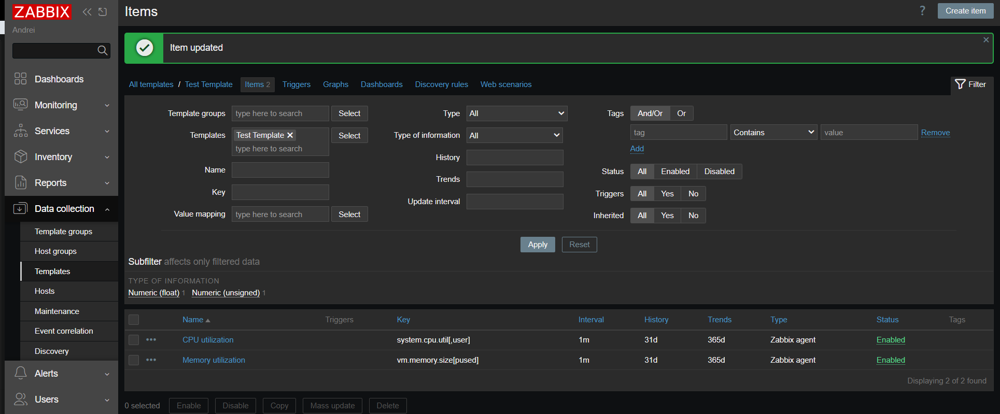
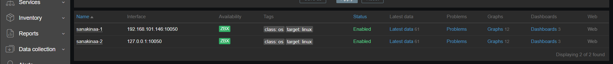
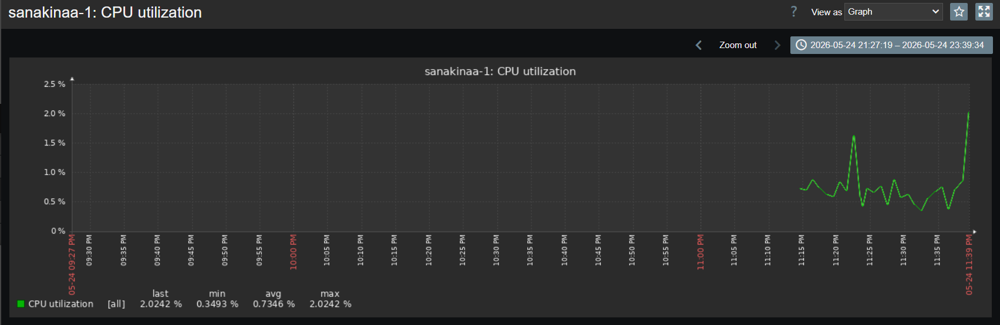
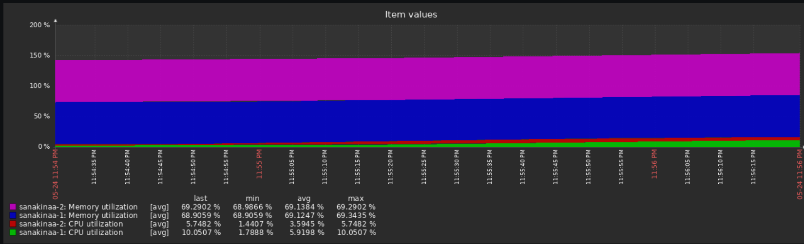
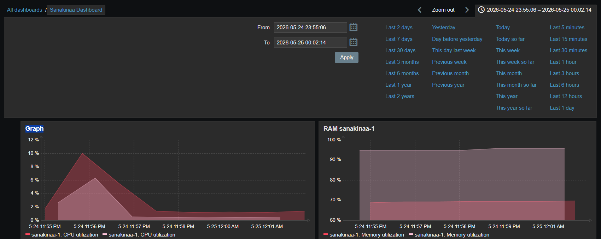
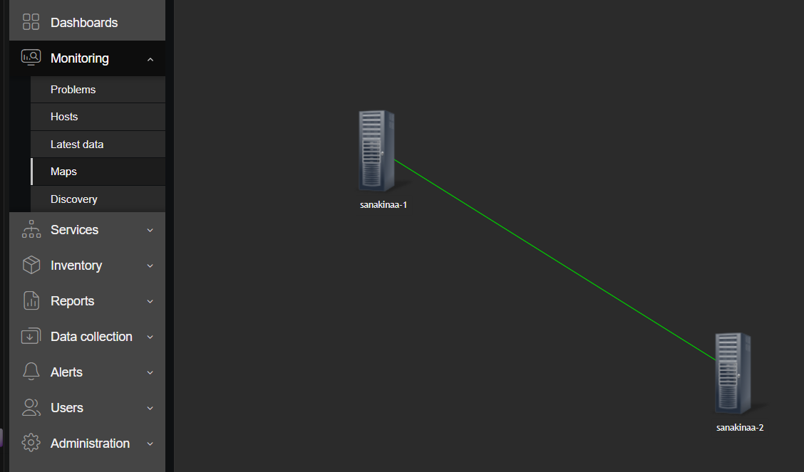
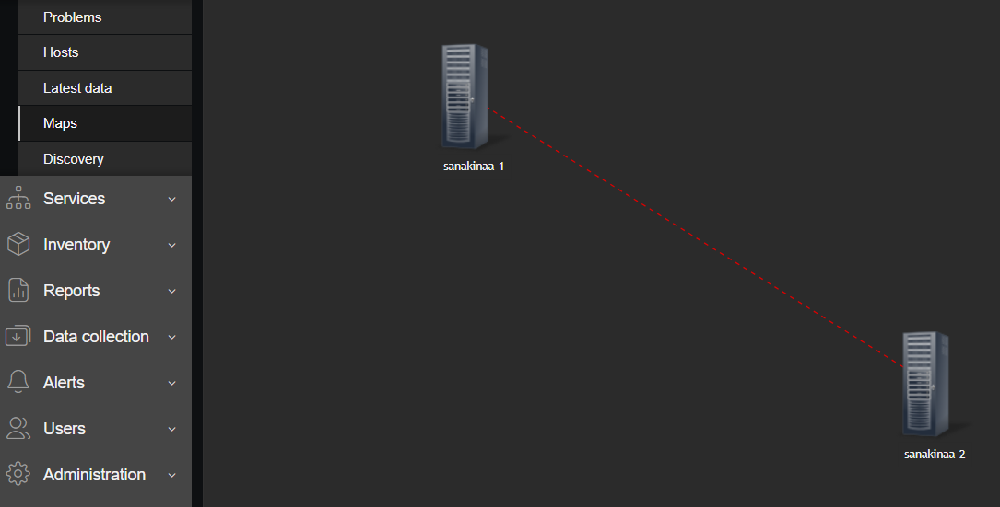
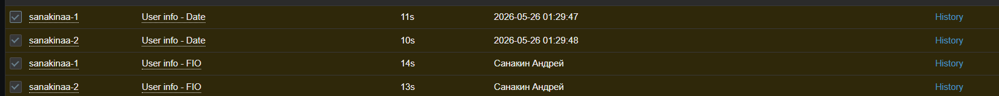

# Домашнее задание: Система мониторинга Zabbix. Часть 2

**Выполнил:** Санакин Андрей

## Задание 1 — Шаблон мониторинга CPU и RAM

Шаблон: **Test Template**

| Item | Key | Интервал |
|------|-----|----------|
| CPU utilization | system.cpu.util[,user,avg1] | 1m |
| Memory utilization | vm.memory.size[pavailable] | 1m |

### Скриншот шаблона:

## Задание 2-3 — Добавление хостов и привязка шаблонов

### Хосты:
| Хост | IP | Статус | Шаблоны |
|------|-----|--------|---------|
| sanakinaa-1 | 192.168.101.146:10050 | 🟢 Enabled | Linux by Zabbix agent, Test Template |
| sanakinaa-2 | 127.0.0.1:10050 | 🟢 Enabled | Linux by Zabbix agent, Test Template |

### Скриншот хостов:

### Графики метрик Test Template:

**CPU utilization:**

**Все метрики (CPU + Memory):**

## Задание 4 — Кастомный дашборд

Дашборд: **Sanakinaa Dashboard**

### Виджеты:
- CPU utilization — sanakinaa-1
- RAM sanakinaa-1 — Memory utilization

### Скриншот дашборда:

## Задание 5* — Карта с триггером

Карта: **Sanakinaa Map**

- Два хоста: `sanakinaa-1` и `sanakinaa-2`
- Линк с триггером `Zabbix agent is not available`
- При срабатывании триггера — **красная пунктирная линка**

### Норма (агент работает):

### Проблема (агент недоступен):

## Задание 6* — UserParameter на Bash

Скрипт: `/etc/zabbix/scripts/userparam_script.sh`

### Код скрипта:
"""bash
#!/bin/bash
case "$1" in
    1) echo "Санакин Андрей" ;;
    2) date '+%Y-%m-%d %H:%M:%S' ;;
    *) echo "Unknown parameter" ;;
esac
"""

### UserParameter в конфиге:
"""ini
UserParameter=user.info[*],/etc/zabbix/scripts/userparam_script.sh $1
"""

### Результат в Latest data:

